# SQL Practice

<ul>
  <li>A relational database consists of tables with fixed columns and varying rows of data, organized in a structured manner</li>
  <li>A relational database consists of tables with fixed columns and varying rows of data, organized in a structured manner</li>
  <li>SQL offers standardized commands like SELECT, INSERT, UPDATE, and DELETE to query and modify data.</li>
  <li>With SQL, users can create, modify, and delete tables, and perform advanced operations like table joining, data filtering, and aggregation.</li>
</ul>

## Lesson 1

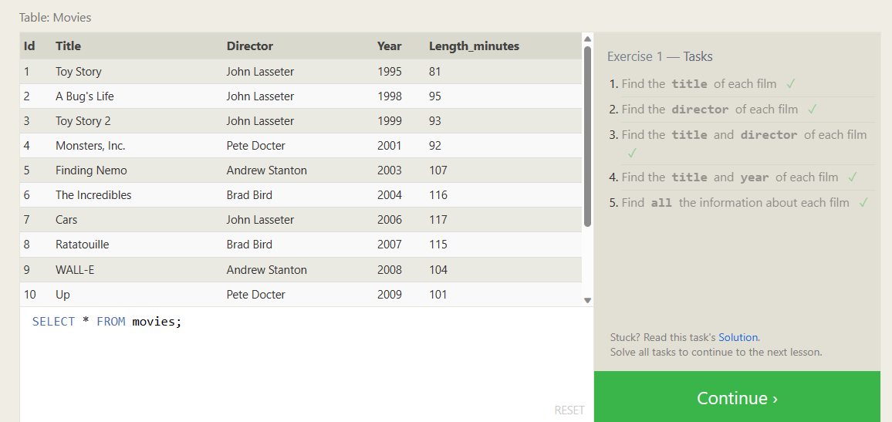

## Lesson 2

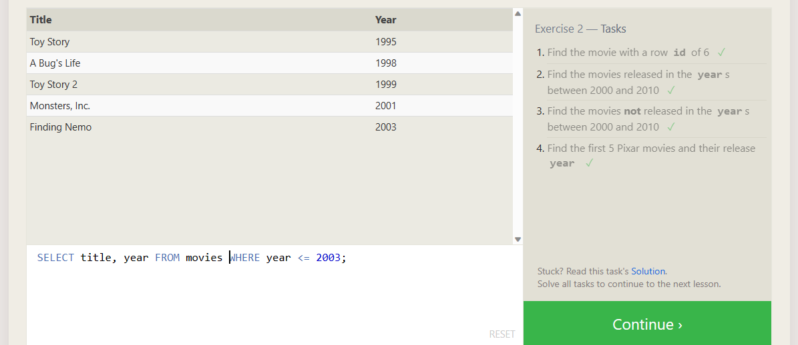

## Lesson 3

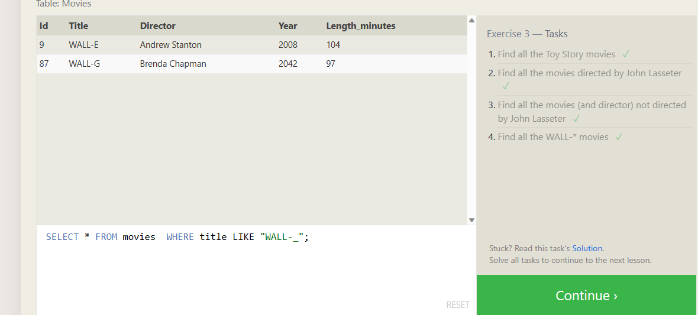

## Lesson 4

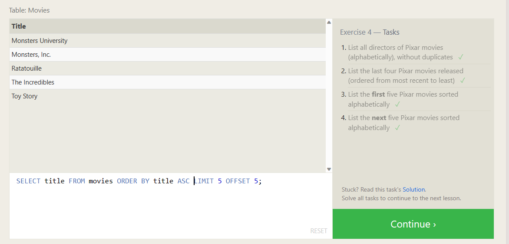

## Lesson 5

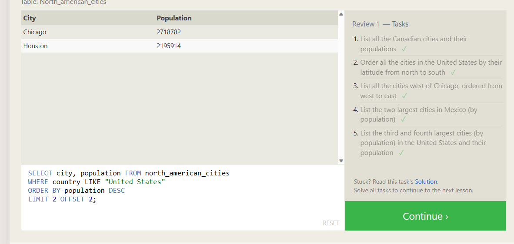

## Lesson 6

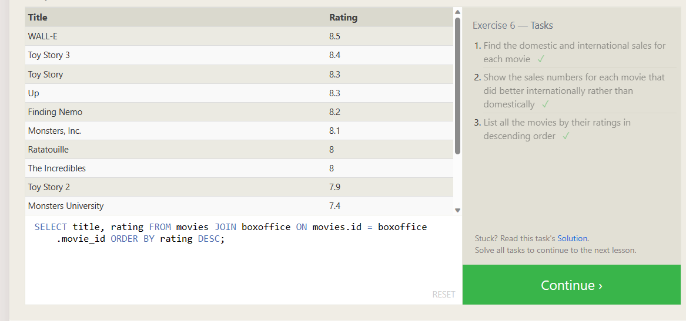

## Lesson 13

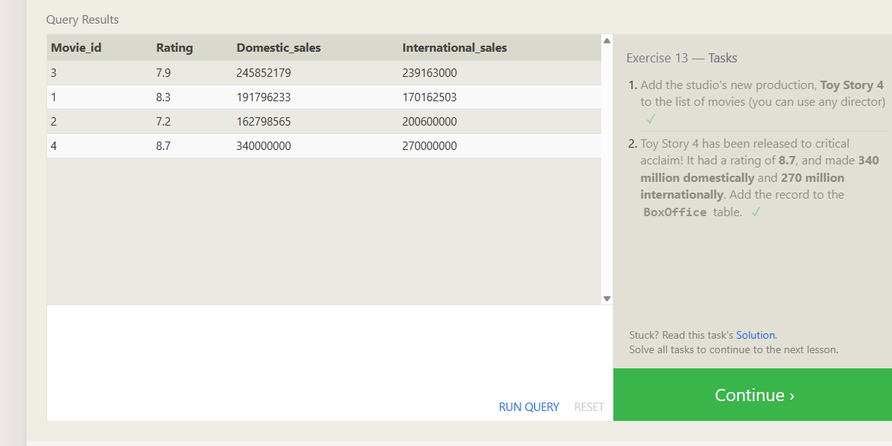

## Lesson 14

## Lesson 15

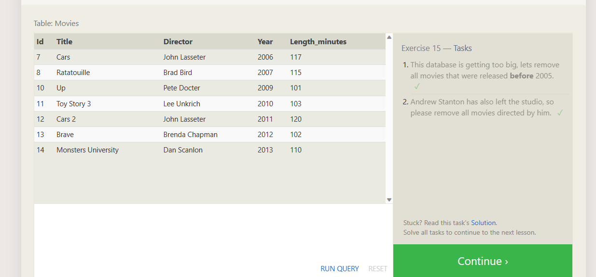

## Lesson 16

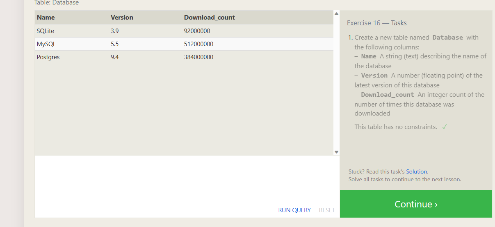

## Lesson 17

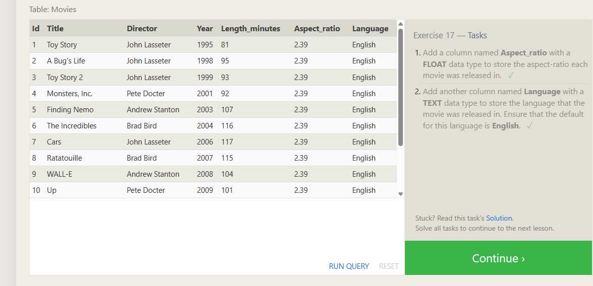

## Lesson 18

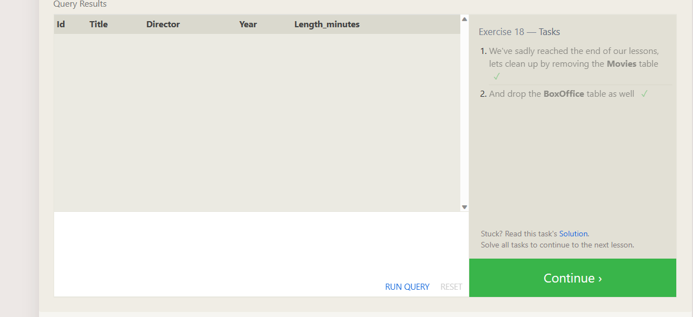